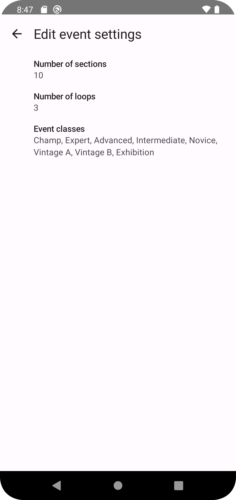

## Summary

This is Android application to help count score for motorcycle trials events.
Its main goal is to help event organizers to count scores and share them quickly at the event location.
It does not require cell reception.
It's only available for Android 8+.
It's in development stage.
It's free and released under GPLv3 license.


## Usage scenario

1. Configure event: classes, number of sections and loops  
2. Import rider list
3. Manually enter or edit rider information if needed
4. Record scores as riders turn in their cards
5. Share scores
6. Export scores to generate final score sheets

### Configure event

You can configure number of sections, loops in the event and classes/lines via Settings menu available from the main screen.
It's best to configure thi before you start entering riders scores since score card is initialized upon first score entry.



When entering classes keep them in the order you want them to be sorted on the leaderboard and separate with comma.

> **Note**
> If imported rider list contains classes that are not configured in the app, they will not be sorted correctly.
> You'll have to adjust event settings or edit each rider and set correct class.

### Import rider list

Assuming you have rider list exported from your registration system. 
Create Excel spreadsheet with just 2 columns: rider name and rider class.

| | | 
| --- | --- |
| Tamara Murazik | Advanced |
| Damian Brakus | Intermediate |
| Uriel Mills | Expert |
| Sabrina McGlynn | Advanced | 
| Shannon Ritchie | Novice |
| Baylee Cruickshank | Intermediate |

Note, do not include table header as application will try to import it as a rider.
Save the spreadsheet as CSV file.
Most spreadsheet application use comma as delimiter, this should work just fine.
If you want to check raw exported file, it should look like this.

```csv
Tamara Murazik,Advanced
Damian Brakus,Intermediate
Uriel Mills,Expert
Sabrina McGlynn,Advanced
Shannon Ritchie,Novice
Baylee Cruickshank,Intermediate
```

Copy file onto device and import the list using application menu from the main screen.


Riders should be loaded on a leaderboard screen, grouped by classes and sorted by name.
If that didn't happen - check that you imported the right CSV file (not .xsl).
If riders are randomly sorted - check rider classes settings.

### Manually enter or edit rider info

You can add new rider from Leaderboard (home) screen.
You can edit rider info from score entry screen. 
Simply tap on rider name and you should see "pencil" icon.

### Entering scores

Leaderboard is sorted using the following order:

* finished riders - by points and then by cleans
* not finisher riders (marked with asterisk) - by first name

Tapping on rider name opens their score entry screen.
Results are saved as you "punch" the score card.
When finished simply use "back" button to return to previous screen.
There is no way to "undo" score entry.
You can clear entire score for the rider using "Clear rider score" menu option in the top right corner.
If you configured event to have more than 1 loop then you should see "tabs" at the top of the screen for each loop.
Loop scores are tallied at the bottom of the screen.
They can be used to cross-check that you entered scores correctly.

### Sharing scores

There are multiple ways to share scores to riders.
The quickest one is to give a tablet to a rider.
Keep in mind that they can edit scores accidentally.
The safest way is to take screenshot and then show it to the rider.
Better yet - use Android's Nearby Share or upload to social media.

In order to take screenshot you need to navigate to "Screenshot view" screen via menu. 
It is specifically designed to assist with built-in screen capturing and provides a more compact view.
From that screen use Android's built-in screenshot feature.
Usually it's done by pressing Power and Volume down buttons at the same time.

### Export results

This application doesn't attempt to generate nice score sheets. 
Instead it lets you export raw results into Excel or similar programs.
You can then generate final score sheets as you probably do right now.

Export is available via the menu on Leaderboard screen.
It generate CSV file that you can import into your spreadsheets application.
Sample output, once imported, look like this.

| Name | Class | Points | Cleans | S1 | S2 | S3 | S4 | S5 | S6 | S7 | S8 | S9 | S10 | S11 | S12 | S13 |
| --- | --- | --- | --- | --- | --- | --- | --- | --- | --- | --- | --- | --- | --- | --- | --- | --- |
| Armani Bergstrom | Expert | 20 | 13 | 0 | 1 | 1 | 0 | 1 | 0 | 1 | 0 | 0 | 0 | 1 | 1 | 2 |  
| Cecilia Collier | Expert | 5   | 26 | 0 | 0 | 0 | 0 | 1 | 0 | 0 | 0 | 0 | 0 | 0 | 0 | 0 | 
| Dorothy Rogahn | Expert | 76   |  0 | 1 | 2 | 1 | 1 | 3 | 2 | 5 | 3 | 2 | 3 | 2 | 1 | 2 |

Optionally, you can use COTA's [Template in Google Sheets](https://docs.google.com/spreadsheets/d/1aMZEi1WcBQEfJGOWEU7NInSvvOIgonkkfros3nR7968/edit?usp=sharing) 
as a starting point.
Make a copy and modify to your taste (mostly classes).


Sorry, no detailed guide for this part yet.

## How to get access and start using it

As of November 2023 this application is still in Closed testing.
I'm actively working to promote it to open beta testing and make it publicly available.
At this moment it was in use at every event by COTA club in Oregon for 2 years and worked without any issues.

As mentioned earlier this application requires Android device to run. 
It doesn't work with Apple devices, but I'm open for contributions if someone is willing to port it.
Android device options are vast and vary in price.
I'm personally using Samsung Galaxy Tab A7 Lite that I got used for $40 and it works just fine.
There is also Lenovo Tab M9 that is much newer and is available for $113 new.
Or you can get Galaxy Tab Active3 that is weather resistant and costs $500 new.
Just look for Android 8+ device with 8"-9" screen from a major brand so that it's supported for several years.
In our experience this works best.

Try simulating score entry before the event.
Event pressure doesn't help when you try to figure out why something doesn't work.
Consider using the app as a cross-check for your first event.
Or, use it only for some of the classes you have at the event.

Ready to give it a try?
[Join open testing](https://play.google.com/store/apps/details?id=net.yakavenka.trialsscore) from your Android device.
Get in touch with me on [facebook](https://www.facebook.com/vitali.yakavenka/) if you have iny questions.

## Roadmap
See [issues on GitHub](https://github.com/velovint/trials-score/issues) for future ideas and their status.
