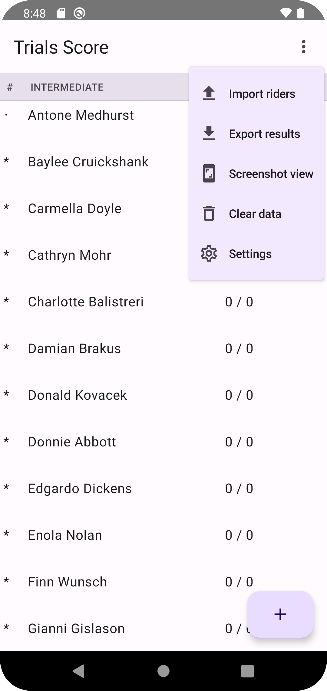

## Summary

This is Android application to help count score for motorcycle trials events.
Its main goal is to help event organizers to count scores and share them quickly at the event location.
It does not require cell reception.
It's only available for Android 8+.
It's in development stage.
It's free and released under GPLv3 license.


## Usage scenario
1. Configure event: classes, number of laps and sections (incomplete)  
2. Import rider list
3. Manually enter or edit rider information if needed
4. Record scores as riders turn in their cards
5. Share scores
6. Export scores to generate final score sheets

### Configure event
This feature not implemented

### Import rider list
Assuming you have rider list exported from your registration system. 
Create Excel spreadsheet with just 2 columns: rider name and rider class.
It's best to keep rider class matching classes you configured in the app.
Otherwise you'll have to edit each rider in the app and set correct class.

| Tamara Murazik | Advanced |
| Damian Brakus | Intermediate |
| Uriel Mills | Expert |
| Sabrina McGlynn | Advanced | 
| Shannon Ritchie | Novice |
| Baylee Cruickshank | Intermediate |

Note, do not include header as application will try to import it as a rider.
Save the spreadsheet as CSV file.
Most spreadsheet application use comma as delimiter, this should work just fine.
If you want to check raw exported file, it should look like this.

```csv
Tamara Murazik,Advanced
Damian Brakus,Intermediate
Uriel Mills,Expert
Sabrina McGlynn,Advanced
Shannon Ritchie,Novice
Baylee Cruickshank,Intermediate
```

Copy file onto device and import the list using application menu from the main screen



## Roadmap
TODO